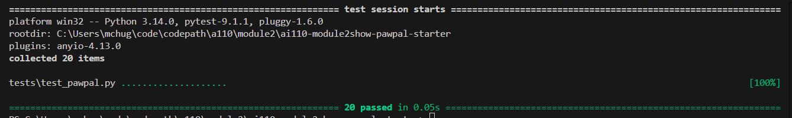

# PawPal+ (Module 2 Project)

You are building **PawPal+**, a Streamlit app that helps a pet owner plan care tasks for their pet.

## Scenario

A busy pet owner needs help staying consistent with pet care. They want an assistant that can:

- Track pet care tasks (walks, feeding, meds, enrichment, grooming, etc.)
- Consider constraints (time available, priority, owner preferences)
- Produce a daily plan and explain why it chose that plan

Your job is to design the system first (UML), then implement the logic in Python, then connect it to the Streamlit UI.

## What you will build

Your final app should:

- Let a user enter basic owner + pet info
- Let a user add/edit tasks (duration + priority at minimum)
- Generate a daily schedule/plan based on constraints and priorities
- Display the plan clearly (and ideally explain the reasoning)
- Include tests for the most important scheduling behaviors

## ✨ Features

PawPal+ implements the following scheduling algorithms (all live in `Scheduler`/`Task`):

- **Sorting by time of day** — `sort_by_time()` / `organize()` order every task earliest-first in `O(n log n)`. Untimed tasks (`time is None`) sort last by using `time.max` as their key, and the original list is never mutated.
- **Filtering** — `filter_tasks()` narrows tasks by completion status and/or pet name, combining the two conditions with AND. `organize(frequency=...)` further restricts a plan to a single frequency.
- **Conflict warnings** — `find_conflicts()` buckets tasks by exact time of day and returns each group of 2+ that clash (across pets, since one owner can't be in two places at once). `has_conflicts()` gives a quick boolean, and `conflict_warning()` returns a human-readable, never-crashing message for the UI. Detection is exact-time only, not overlapping durations.
- **Daily/weekly recurrence** — completing a recurring task (`Task.complete()` → `spawn_next()`) auto-creates a fresh, pending copy on the same pet for its next occurrence. `once` and `monthly` do not recur, and completing a task twice is idempotent (no duplicate spawns).
- **"Up next" lookup** — `next_task()` returns the single earliest pending task across all pets.
- **Multi-pet / multi-owner aggregation** — the scheduler gathers tasks across every pet of every registered owner, de-duplicating pets that are shared between owners so they're counted once.

## Getting started

### Setup

```bash
python -m venv .venv
source .venv/bin/activate  # Windows: .venv\Scripts\activate
pip install -r requirements.txt
```

### Suggested workflow

1. Read the scenario carefully and identify requirements and edge cases.
2. Draft a UML diagram (classes, attributes, methods, relationships).
3. Convert UML into Python class stubs (no logic yet).
4. Implement scheduling logic in small increments.
5. Add tests to verify key behaviors.
6. Connect your logic to the Streamlit UI in `app.py`.
7. Refine UML so it matches what you actually built.

## 🖥️ Sample Output

Paste a sample of your app's CLI or Streamlit output here so a reader can see what a generated plan looks like:
-------------------------------------------


========================================
Today's Schedule
========================================
  07:30  |  Mia    |  Breakfast
  08:00  |  Rex    |  Morning walk
  12:00  |  Mia    |  Clean litter box
  18:30  |  Rex    |  Evening walk
----------------------------------------
  4 task(s) scheduled


--------------------------------------
```
# e.g.:
# Daily plan for Biscuit (Golden Retriever):
#   08:00 — Morning walk (30 min) [priority: high]
#   09:00 — Feeding (10 min) [priority: high]
#   ...
```

## 🧪 Testing PawPal+

The test suite lives in [`tests/test_pawpal.py`](tests/test_pawpal.py) and covers the
core scheduling behaviors. It uses plain `assert` statements, so it runs either
under `pytest` or directly with the standard library.


Confidnece level - 4

```bash
# Run the full suite with pytest (auto-discovers test_* functions):
python -m pytest

# ...or run it directly, no dependencies required:
python tests/test_pawpal.py
```

### What's covered

| Behavior | What we verify |
|----------|----------------|
| **Sorting correctness** | `sort_by_time()` / `organize()` return tasks in ascending time-of-day order; untimed tasks sort last; the input list is not mutated |
| **Recurrence logic** | Completing a daily/weekly task spawns a fresh, pending copy on the same pet; `once`/`monthly` do not recur; completing twice is idempotent (no duplicates) |
| **Conflict detection** | `find_conflicts()` flags tasks sharing the exact same time (within and across pets); completed and untimed tasks are ignored; `conflict_warning()` returns a readable string and never crashes |
| **Filtering** | `filter_tasks()` narrows by completion status and/or pet name, combining with AND |
| **Edge cases** | Empty scheduler, a pet with no tasks, and a pet shared by two owners (counted once) |

Sample test output:

```
# Paste your `pytest` output here, e.g.:
# ==================== 20 passed in 0.03s ====================
```

## 📐 Smarter Scheduling

| Feature | Method(s) | Notes |
|---------|-----------|-------|
| Task sorting | `Scheduler.sort_by_time()` | Orders by time of day; untimed tasks sort last |
| Filtering | `Scheduler.filter_tasks()` | By completion status and/or pet name (AND) |
| Conflict handling | `Scheduler.find_conflicts()`, `has_conflicts()`, `conflict_warning()` | Flags same-time clashes across pets; warns without crashing. Exact-time only, not overlaps |
| Recurring tasks | `Task.complete()` / `Task.spawn_next()` | Daily/weekly auto-spawn next occurrence; once/monthly do not |

## 📸 Demo Walkthrough

### Main UI features

The Streamlit app (`app.py`) is organized top-to-bottom into the actions a user performs:

- **Owner** — set the owner's name; it stays in sync across reruns.
- **Add a Pet** — enter name, species, breed, and age, then click **Add pet**. Duplicate names for the same owner are rejected, and current pets are listed back.
- **Schedule a Task** — pick a pet, give the task a title, choose a time of day and a frequency (`once` / `daily` / `weekly` / `monthly`), then click **Add task**.
- **Complete a Task** — pick any pending task and click **Mark complete**; recurring tasks automatically schedule their next occurrence.
- **Build Schedule** — filter the plan by pet, status (Pending / Completed / All), and frequency. The view updates live and shows summary metrics, an "up next" banner, conflict warnings, and a sorted table.

### Example workflow

1. Enter the owner's name (e.g. *Jordan*).
2. **Add a pet** — *Mochi*, a 2-year-old Shiba (dog).
3. **Schedule a task** — a *Morning walk* for Mochi at `08:00`, `daily`.
4. Add a few more tasks at different times (and, to see a clash, one more at `08:00`).
5. **Build Schedule** — leave the filters on *All pets / Pending / All* and watch the table appear, sorted by time of day.
6. Narrow **Pet** or **Frequency** to filter the plan, or switch **Status** to *Completed* to review finished tasks.
7. **Mark a daily task complete** and rebuild the schedule to see its next occurrence reappear as pending.

### Key Scheduler behaviors shown

- **Sorting by time** — tasks always render earliest-first regardless of the order they were added; untimed tasks sort last.
- **Filtering** — the Pet / Status / Frequency selectors map directly onto `filter_tasks()` and the frequency filter.
- **Conflict warnings** — two tasks at the same time trigger a `st.warning` banner and a ⚠️ flag on each clashing row; a clear schedule shows a green `st.success` instead.
- **"Up next"** — the earliest pending task across all pets is surfaced in a banner via `next_task()`.
- **Daily/weekly recurrence** — completing a recurring task auto-spawns its next occurrence on the same pet.

### Sample CLI output (`python main.py`)

The `main.py` demo builds a two-pet household with tasks added out of order (and a deliberate `08:00` clash), then exercises each Scheduler behavior:

```text
====================================================
Tasks in INSERTION order (jumbled on purpose)
====================================================
  18:30  |  Rex    |  Evening walk        (pending)
  08:00  |  Rex    |  Morning walk        (done)
  08:00  |  Rex    |  Morning walk        (pending)
  12:00  |  Mia    |  Clean litter box    (pending)
  07:30  |  Mia    |  Breakfast           (pending)
  08:00  |  Mia    |  Vitamins            (pending)

====================================================
Sorted by time  (Scheduler.sort_by_time)
====================================================
  07:30  |  Mia    |  Breakfast           (pending)
  08:00  |  Rex    |  Morning walk        (done)
  08:00  |  Rex    |  Morning walk        (pending)
  08:00  |  Mia    |  Vitamins            (pending)
  12:00  |  Mia    |  Clean litter box    (pending)
  18:30  |  Rex    |  Evening walk        (pending)

====================================================
Filtered: pending only  (filter_tasks(completed=False))
====================================================
  07:30  |  Mia    |  Breakfast           (pending)
  08:00  |  Rex    |  Morning walk        (pending)
  08:00  |  Mia    |  Vitamins            (pending)
  12:00  |  Mia    |  Clean litter box    (pending)
  18:30  |  Rex    |  Evening walk        (pending)

====================================================
Filtered: completed only  (filter_tasks(completed=True))
====================================================
  08:00  |  Rex    |  Morning walk        (done)

====================================================
Filtered: Rex's tasks  (filter_tasks(pet_name='Rex'))
====================================================
  08:00  |  Rex    |  Morning walk        (done)
  08:00  |  Rex    |  Morning walk        (pending)
  18:30  |  Rex    |  Evening walk        (pending)

====================================================
Combined: Rex's pending tasks  (completed=False, pet_name='Rex')
====================================================
  18:30  |  Rex    |  Evening walk        (pending)
  08:00  |  Rex    |  Morning walk        (pending)

====================================================
Recurrence: completing a daily task spawns the next
====================================================
  Pending before: 5
  Completing daily task: Rex - Evening walk
  -> auto-scheduled next daily occurrence: Rex - Evening walk (18:30)
  Pending after:  5

  Schedule now (pending, sorted by time):
  07:30  |  Mia    |  Breakfast           (pending)
  08:00  |  Rex    |  Morning walk        (pending)
  08:00  |  Mia    |  Vitamins            (pending)
  12:00  |  Mia    |  Clean litter box    (pending)
  18:30  |  Rex    |  Evening walk        (pending)

====================================================
Conflict detection (lightweight warning)
====================================================
[!] Scheduling conflicts found:
  08:00 - 2 tasks overlap: Morning walk (Rex), Vitamins (Mia)

  Verified: has_conflicts() == True
```
